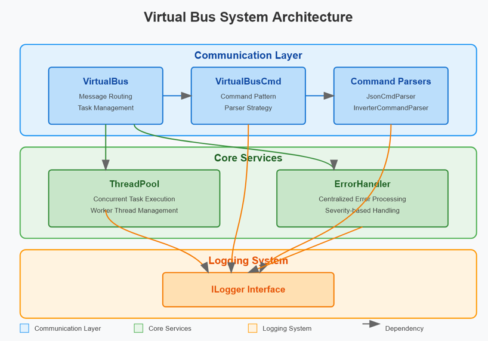

# VirtualBus - Embedded Communication Framework

<p align="center">
  
</p>

> **VirtualBus** is a modern C++ embedded system framework providing a virtual communication bus for task-based systems. It enables efficient inter-task communication with support for threading, configuration management, error handling, and external MQTT connectivity.

---

## 📋 Table of Contents

- [Features](#features)
- [Project Overview](#project-overview)
- [Directory Structure](#directory-structure)
- [Quick Start](#quick-start)
- [Installation](#installation)
- [Usage](#usage)
- [Architecture](#architecture)
- [Configuration](#configuration)
- [API Reference](#api-reference)
- [Examples](#examples)
- [License](#license)

---

## ✨ Features

- **Virtual Communication Bus**: Task-to-task message passing with thread-safe queue management
- **Thread Pool**: Configurable multi-threaded task execution
- **Configuration Management**: JSON-based application configuration
- **Logging**: Dual logging backends (spdlog for production, stdout for debugging)
- **Error Handling**: Comprehensive error handling with severity levels
- **MQTT Support**: External communication via Paho MQTT (C and C++ libraries)
- **Task Management**: Attach/detach tasks dynamically with callback support
- **AUTOSAR Compliance**: Naming conventions and structure follow AUTOSAR Adaptive standards

---

## 🎯 Project Overview

VirtualBus is an embedded communication framework designed for real-time systems like inverters, battery management systems (BMS), and IoT devices. It provides:

1. **Virtual Bus Architecture**: A central message broker for all task communications
2. **Sender/Receiver Model**: Asynchronous message passing between tasks
3. **Command Pattern**: Type-safe command objects for structured message passing
4. **Configuration System**: Dynamic configuration loading and management
5. **Robust Logging**: Structured logging with multiple backends

### Key Use Cases

- Battery Management Systems (BMS)
- Power Inverter Control
- Solar Charge Controllers
- IoT Gateway Applications
- Real-time Embedded Systems

---

## 📁 Directory Structure

```
VirtualBus/
├── src/                          # Application source code
│   ├── main.cpp                  # Main application entry point
│   ├── SendTask.h                # Task for sending commands
│   ├── ReciveTask.h              # Task for receiving commands
│   ├── InverterCommand.h          # Inverter-specific command implementation
│   ├── InverterCommandParser.h    # Parser for inverter commands
│   ├── BatteryCommand.h           # Battery-specific command implementation
│   └── BatteryCommandParser.h     # Parser for battery commands
│
├── libs/unicore/                 # Core framework library
│   ├── include/                  # Header files
│   │   ├── VirtualBus.h          # Main bus implementation
│   │   ├── VirtualBusCmd.h       # Base command class
│   │   ├── Task.h                # Base task class
│   │   ├── ThreadPool.h          # Thread pool implementation
│   │   ├── Configuration.h       # Configuration management
│   │   ├── JsonStorage.h         # JSON storage backend
│   │   ├── ErrorHandler.h        # Error handling utilities
│   │   ├── ILogger.h             # Logger interface
│   │   ├── SpdLogWrapper.h       # spdlog wrapper implementation
│   │   ├── StdCoutLogger.h       # stdout logger implementation
│   │   ├── DiagnosticTask.h      # Diagnostic utilities
│   │   ├── IClock.h              # Clock interface (injectable time source)
│   │   ├── SystemClock.h         # Real-time IClock implementation
│   │   ├── VirtualClock.h        # Settable/advanceable IClock for tests
│   │   ├── Watchdog.h            # Task liveness monitoring (kick()/timeout reporting)
│   │   ├── ObjectPool.h          # Zero-copy variant: pre-allocated object pool (placement-new, no heap alloc on the send hot path)
│   │   ├── ITransport.h          # Distributed variant: abstract byte-stream transport
│   │   ├── LoopbackTransport.h   # In-process ITransport, for deterministic RemoteBridge tests
│   │   ├── TcpTransport.h        # Real point-to-point ITransport over a TCP socket
│   │   ├── CommandFactory.h      # CommandType -> concrete VirtualBusCmd subclass registry
│   │   └── RemoteBridge.h        # Gateway: bridges a local VirtualBus to a remote peer over an ITransport
│   │
│   └── src/                      # Implementation files
│       ├── VirtualBus.cpp
│       ├── VirtualBusCmd.cpp
│       ├── ThreadPool.cpp
│       ├── ErrorHandler.cpp
│       ├── Watchdog.cpp
│       ├── LoopbackTransport.cpp
│       ├── TcpTransport.cpp
│       └── RemoteBridge.cpp
│
├── tests/                        # Unit tests
├── cmake/                        # CMake modules
├── externallib/                  # External dependencies
├── CMakeLists.txt               # CMake build configuration
├── fetch_and_build.sh           # Linux/macOS build script
├── fetch_and_build.ps1          # Windows build script
├── fetch_and_build.py           # Python cross-platform build script
├── config.json                  # Configuration file (example)
├── version.txt                  # Project version
└── README.md                    # This file
```

---

## 🚀 Quick Start

### Prerequisites

- **C++ Compiler**: C++17 or later
- **CMake**: Version 3.15 or higher
- **Python**: For build scripts (optional)
- **OpenSSL**: For MQTT secure connections
- **Git**: For cloning the repository

### Build & Run (Linux/macOS)

```bash
# Clone the repository
git clone https://github.com/rtsysembedded/VirtualBus.git
cd VirtualBus

# Build using the provided script
bash fetch_and_build.sh

# Run the application
./build/CPPProject
```

### Build & Run (Windows)

```powershell
# Using PowerShell
.\fetch_and_build.ps1
```

### Build & Run (Cross-Platform with Python)

```bash
python3 fetch_and_build.py
```

---

## 📦 Installation

### System Requirements

#### Linux (Ubuntu/Debian)
```bash
# Install dependencies
sudo apt-get update
sudo apt-get install -y \
    build-essential \
    cmake \
    libssl-dev \
    git \
    python3
```

#### macOS
```bash
# Install dependencies using Homebrew
brew install cmake openssl git python3
```

#### Windows
```powershell
# Using vcpkg (recommended)
git clone https://github.com/Microsoft/vcpkg.git
cd vcpkg
.\vcpkg integrate install
.\vcpkg install openssl:x64-windows
```

### Project Installation

1. **Clone the Repository**
   ```bash
   git clone https://github.com/rtsysembedded/VirtualBus.git
   cd VirtualBus
   ```

2. **Configure Build**
   ```bash
   mkdir build
   cd build
   cmake .. -DCMAKE_BUILD_TYPE=Release
   ```

3. **Build**
   ```bash
   cmake --build . --config Release
   ```

4. **Install (Optional)**
   ```bash
   sudo cmake --install .
   ```

See [INSTALLATION.md](./INSTALLATION.md) for detailed platform-specific instructions.

---

## 📖 Usage

### Basic Example

```cpp
#include "VirtualBus.h"
#include "SendTask.h"
#include "ReciveTask.h"

int main() {
    // Create logger
    auto logger = std::make_shared<SpdLogWrapper>();
    
    // Initialize virtual bus
    VirtualBus bus(logger);
    
    // Create and attach tasks
    SendTask sender("Sender", bus, logger);
    ReceiveTask receiver("Receiver", bus, logger);
    
    bus.attach(sender.getID(), sender.getName());
    bus.attach(receiver.getID(), receiver.getName());
    
    // Start tasks
    sender.start();
    receiver.start();
    
    // Let tasks run
    std::this_thread::sleep_for(std::chrono::seconds(10));
    
    // Cleanup
    sender.stop();
    receiver.stop();
    bus.shutdown();
    
    sender.join();
    receiver.join();
    
    return 0;
}
```

See [USAGE.md](./USAGE.md) for comprehensive usage examples and API documentation.

---

## 🏗️ Architecture

### Virtual Bus Architecture

The VirtualBus employs a message-passing architecture:

```
┌─────────────────────────────────────────┐
│         Virtual Bus Core                │
│  ┌─────────────────────────────────┐   │
│  │    Message Queue Manager        │   │
│  │  - Task registration            │   │
│  │  - Message routing              │   │
│  │  - Callback management          │   │
│  └─────────────────────────────────┘   │
└──────────────┬──────────────────────────┘
               │
    ┌──────────┼──────────┐
    │          │          │
┌───▼───┐  ┌──▼───┐  ┌───▼───┐
│TaskA  │  │TaskB │  │TaskC  │
│       │  │      │  │       │
│Send   │  │Recv  │  │Process│
└───────┘  └──────┘  └───────┘
```

### Key Components

1. **VirtualBus**: Central message broker
2. **Task**: Base class for runnable components
3. **VirtualBusCmd**: Base class for commands/messages
4. **ThreadPool**: Manages worker threads
5. **Configuration**: Manages application settings
6. **Logger**: Provides logging functionality
7. **ErrorHandler**: Centralized error management

See [ARCHITECTURE.md](./ARCHITECTURE.md) for detailed architecture documentation.

---

## ⚙️ Configuration

### Configuration File (config.json)

```json
{
    "log_level": "info",
    "max_threads": "4",
    "mqtt_broker": "mqtt://localhost:1883",
    "mqtt_client_id": "virtualbus_client",
    "task_timeout": "5000",
    "enable_watchdog": true,
    "watchdog_timeout": "30000"
}
```

### Configuration Methods

#### Load Configuration
```cpp
Configuration& config = Configuration::getInstance();
config.setLogger(logger);
config.setStorage(std::make_unique<JsonStorage>(logger));

if (config.load("config.json")) {
    std::string logLevel = config.getConfig("log_level");
}
```

#### Save Configuration
```cpp
config.setConfig("log_level", "debug");
config.save("updated_config.json");
```

See [CONFIGURATION.md](./CONFIGURATION.md) for detailed configuration options.

---

## 🔧 API Reference

### VirtualBus Class

```cpp
class VirtualBus {
public:
    // Attach a task to the bus
    ReturnType attach(int taskId, const std::string& taskName);
    
    // Detach a task from the bus
    void detach(int taskId);
    
    // Register a callback for message handling
    void registerCallback(int taskId, CallbackFunction callback);
    
    // Send a message from a sender to the bus
    void sendMessage(int senderId, const std::shared_ptr<VirtualBusCmd>& message);
    
    // Receive a message for a specific task
    bool receiveMessage(int taskId, std::shared_ptr<VirtualBusCmd>& message);
    
    // Shutdown the bus
    void shutdown();
};
```

### Task Class

```cpp
class Task {
public:
    virtual ~Task() = default;
    
    // Start the task execution
    virtual void start();
    
    // Stop the task execution
    virtual void stop();
    
    // Wait for task completion
    virtual void join();
    
    // Get task ID
    int getID() const;
    
    // Get task name
    std::string getName() const;
    
protected:
    // Override this method to implement task logic
    virtual void run() = 0;
};
```

See [API.md](./API.md) for complete API documentation.

---

## 💡 Examples

### Example 1: Inverter Command Processing

```cpp
// Create an inverter command
auto command = std::make_shared<InverterCommand>();
command->setVoltage(48.6);
command->setCurrent(15.0);
command->setMode(InverterCommand::Mode::Charging);
command->updateTimestamp();

// Send via bus
bus.sendMessage(senderId, command);
```

### Example 2: Custom Task

```cpp
class MyCustomTask : public Task {
protected:
    void run() override {
        while (running_) {
            auto msg = std::make_shared<VirtualBusCmd>();
            bus_.sendMessage(id_, msg);
            std::this_thread::sleep_for(std::chrono::seconds(1));
        }
    }
};
```

See [EXAMPLES.md](./EXAMPLES.md) for more detailed examples.

---

## 🛠️ Building from Source

### CMake Build Options

```bash
# Enable/disable spdlog
cmake .. -DENABLE_SPDLOG=ON

# Set build type
cmake .. -DCMAKE_BUILD_TYPE=Release

# Use custom toolchain
cmake .. -DCMAKE_TOOLCHAIN_FILE=<path/to/toolchain.cmake>
```

### Build Scripts

- **Linux/macOS**: `bash fetch_and_build.sh`
- **Windows**: `.\fetch_and_build.ps1`
- **Cross-platform**: `python3 fetch_and_build.py`

---

## 📝 Logging

### Logging Backends

1. **spdlog** (Production): High-performance structured logging
2. **StdCoutLogger** (Development): Simple console logging

### Enable Logging

```cpp
#ifdef USE_SPDLOG
auto logger = std::make_shared<SpdLogWrapper>();
#else
auto logger = std::make_shared<StdCoutLogger>();
#endif

logger->info("Application started");
logger->warn("Warning message");
logger->error("Error message");
```

---

## 🧪 Testing

Run unit tests (if available):

```bash
cd build
ctest --output-on-failure
```

---

## 📄 Documentation Files

- **[README.md](./README.md)** - Project overview (this file)
- **[INSTALLATION.md](./INSTALLATION.md)** - Detailed installation instructions
- **[USAGE.md](./USAGE.md)** - Comprehensive usage guide
- **[ARCHITECTURE.md](./ARCHITECTURE.md)** - System architecture details
- **[API.md](./API.md)** - Complete API reference
- **[CONFIGURATION.md](./CONFIGURATION.md)** - Configuration options
- **[EXAMPLES.md](./EXAMPLES.md)** - Code examples and recipes
- **[TROUBLESHOOTING.md](./TROUBLESHOOTING.md)** - Common issues and solutions

---

## 🔄 Build System

The project uses CMake for cross-platform building:

- **Minimum CMake**: 3.15
- **C++ Standard**: C++17
- **Supported Platforms**: Linux, macOS, Windows

### External Dependencies

- **Paho MQTT**: Message Queuing Telemetry Transport
- **spdlog**: Fast C++ logging library
- **OpenSSL**: Cryptographic library for MQTT secure connections

---

## 📊 Version Management

The project includes automatic version management:

```bash
# Version is in version.txt
cat version.txt

# Version is automatically incremented on builds
# via increment_version.py
```

---

## 🤝 Contributing

Contributions are welcome! Please:

1. Fork the repository
2. Create a feature branch (`git checkout -b feature/AmazingFeature`)
3. Commit changes with clear messages
4. Push to the branch
5. Open a Pull Request

See [CONTRIBUTING.md](./CONTRIBUTING.md) for detailed guidelines.

---

## 📖 Resources

- **AUTOSAR Standards**: https://www.autosar.org/
- **C++ Reference**: https://en.cppreference.com/
- **CMake Documentation**: https://cmake.org/documentation/
- **spdlog GitHub**: https://github.com/gabime/spdlog
- **Paho MQTT**: https://www.eclipse.org/paho/

---

## ⚠️ Troubleshooting

### Build Issues

- **CMake not found**: Ensure CMake 3.15+ is installed
- **OpenSSL not found**: Install libssl-dev (Linux) or use vcpkg (Windows)
- **Python 3 not found**: Required for version management scripts

See [TROUBLESHOOTING.md](./TROUBLESHOOTING.md) for detailed solutions.

---

## 📄 License

This project is licensed under the **MIT License** - see the [LICENSE](./LICENSE) file for details.

Copyright © 2025 rtsysEmbedded

---

## 📞 Support

For issues, questions, or suggestions:

- Open an issue on GitHub
- Check [TROUBLESHOOTING.md](./TROUBLESHOOTING.md)
- Review [EXAMPLES.md](./EXAMPLES.md) for common patterns

---

## 🎓 Learning Resources

- Study the example code in `src/` directory
- Review the header files in `libs/unicore/include/`
- Check the example tasks (SendTask, ReceiveTask)
- Explore configuration examples in `config.json`

---

## ✅ Checklist for New Users

- [ ] Read this README
- [ ] Follow [INSTALLATION.md](./INSTALLATION.md) to set up
- [ ] Build the project successfully
- [ ] Run the example application
- [ ] Review [USAGE.md](./USAGE.md) for API usage
- [ ] Check [EXAMPLES.md](./EXAMPLES.md) for code patterns
- [ ] Read [ARCHITECTURE.md](./ARCHITECTURE.md) for system design

---

**Happy coding with VirtualBus!** 🚀
